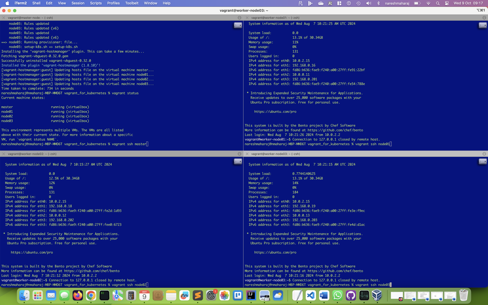

Start by creating your Vagrant environment. Below is a script that will get everything up and running.

Call the  `_start.sh` as this will take care of setup and ensure all the ip addresses and FQDN are
available from all machines. In the end you will have 4 machines running. 

### Vagrant
#### Script for Vagrant machines.
```bash
cat <<EOF> _start.sh
start=`date +%s`
vagrant up | tee log.txt
vagrant plugin install vagrant-hostmanager
vagrant hostmanager
end=`date +%s`

runtime=$((end-start))
echo Time taken to complete: $runtime in seconds
EOF
```

#### Vagrant Script for k8s nodes
```bash
cat <<EOF> Vagrantfile
NUM_WORKER_NODES=3
IP_NW="10.0.0."
IP_START=10
IP_NW_PUBLIC="192.168.0."
IP_START_PUBLIC=200

Vagrant.configure("2") do |config|
  config.vm.provision "shell", env: {"IP_NW" => IP_NW, "IP_START" => IP_START}, inline: <<-SHELL
      apt-get update -y
      echo "$IP_NW$((IP_START)) master-node" >> /etc/hosts
  SHELL

  (1..NUM_WORKER_NODES).each do |i|
    INTERNAL_IP = IP_NW + "#{IP_START + i}"
    config.vm.provision "shell", env: {"IP_NW" => IP_NW, "IP_START" => IP_START}, inline: <<-SHELL
      echo #{INTERNAL_IP} worker-node0#{i} >> /etc/hosts
    SHELL
  end

  config.vm.synced_folder "shared/", "/shared", create: true
  config.vm.synced_folder "data/", "/data", create: true
  config.vm.provision "shell", path: "swap.off.sh"
  config.vm.provision "shell", path: "add-fw-rules.sh"
  #config.vm.provision "shell", path: "setup-k8s.sh"
  config.vm.box = "bento/ubuntu-22.04"
  config.vm.box_check_update = true
  config.vm.boot_timeout = 600
  config.vm.provision "file", source: "setup-k8s.sh", destination: "setup-k8s.sh"
  config.vm.network "public_network", bridge: "en0: Wi-Fi"

  config.vm.define "master" do |master|
    # master.vm.box = "bento/ubuntu-18.04"
    master.vm.hostname = "master-node"
    master.vm.network "private_network", ip: IP_NW + "#{IP_START}"
    master.vm.network "public_network", ip: IP_NW_PUBLIC + "#{IP_START_PUBLIC}", bridge: "en0: Wi-Fi"
    master.vm.provider "virtualbox" do |vb|
        vb.memory = 4048
        vb.cpus = 2
    end
    #master.vm.provision "shell", path: "scripts/common.sh"
    #master.vm.provision "shell", path: "scripts/master.sh"
  end

  (1..NUM_WORKER_NODES).each do |i|

  config.vm.define "node0#{i}" do |node|
    node.vm.hostname = "worker-node0#{i}"
    node.vm.network "private_network", ip: IP_NW + "#{IP_START + i}"
    node.vm.network "public_network", ip: IP_NW_PUBLIC + "#{IP_START_PUBLIC + i}", bridge: "en0: Wi-Fi"
    node.vm.provider "virtualbox" do |vb|
        vb.memory = 2048
        vb.cpus = 1
    end
    #node.vm.provision "shell", path: "scripts/common.sh"
    #node.vm.provision "shell", path: "scripts/node.sh"
  end

  end
end
EOF
```

After running the `_start.sh` you should have 4 machines 

```text
vagrant status
Current machine states:

master                    running (virtualbox)
node01                    running (virtualbox)
node02                    running (virtualbox)
node03                    running (virtualbox)
```

Open 4 terminal windows and ssh into each instance `vagrant ssh hostname`



### Kubernetes

#### The hard way - good to learn
Once logged in run the `setup-k8s.sh` file in each host. The file will determine which node is the master and worker nodes
and thus carry out the correct install and set up.

```bash
cat <<EOF> setup-k8s.sh
cd ~
VER=1.27
PWD=`pwd`
IP=`hostname -i | awk '{print $2}'`

IP_MASTER=0.0.0.0
if [[ `hostname -s` = "master-node" ]]; then
        IP_MASTER=`hostname -i | awk '{print $2}'`
	echo $IP_MASTER
fi

sudo modprobe br_netfilter

echo "START Forwarding IPv4 and letting iptables see bridged traffic"
cat <<EOF | sudo tee /etc/modules-load.d/k8s.conf
overlay
br_netfilter
EOF

sudo modprobe overlay
sudo modprobe br_netfilter

# sysctl params required by setup, params persist across reboots
cat <<EOF | sudo tee /etc/sysctl.d/k8s.conf
net.bridge.bridge-nf-call-iptables  = 1
net.bridge.bridge-nf-call-ip6tables = 1
net.ipv4.ip_forward                 = 1
EOF

# Apply sysctl params without reboot
sudo sysctl --system
echo "COMPLETED Forwarding IPv4 and letting iptables see bridged traffic"

wget https://github.com/containerd/containerd/releases/download/v1.6.9/containerd-1.6.9-linux-amd64.tar.gz
sudo tar Cxzvf /usr/local ${PWD}/containerd-1.6.9-linux-amd64.tar.gz
wget https://raw.githubusercontent.com/containerd/containerd/main/containerd.service
sudo mv ${PWD}/containerd.service /lib/systemd/system/
sudo systemctl daemon-reload
sudo systemctl enable --now containerd
wget https://github.com/opencontainers/runc/releases/download/v1.1.4/runc.amd64
sudo install -m 755 ${PWD}/runc.amd64 /usr/local/sbin/runc
wget https://github.com/containernetworking/plugins/releases/download/v1.1.1/cni-plugins-linux-amd64-v1.1.1.tgz
sudo mkdir -p /opt/cni/bin
sudo tar Cxzvf /opt/cni/bin ${PWD}/cni-plugins-linux-amd64-v1.1.1.tgz

sudo mkdir -p /etc/containerd/
containerd config default | sudo tee -a /etc/containerd/config.toml
sudo systemctl restart containerd
sudo apt-get update
sudo apt-get install -y apt-transport-https ca-certificates curl
curl -fsSL https://pkgs.k8s.io/core:/stable:/v${VER}/deb/Release.key | sudo gpg --dearmor -o /etc/apt/keyrings/kubernetes-apt-keyring.gpg
temp1='deb [signed-by=/etc/apt/keyrings/kubernetes-apt-keyring.gpg] https://pkgs.k8s.io/core:/stable:/v'
temp2=${VER}'/deb/ /'
temp3=$temp1$temp2
echo $temp3 | sudo tee /etc/apt/sources.list.d/kubernetes.list
sudo apt-get update
sudo apt-get install -y kubelet kubeadm kubectl
sudo apt-mark hold kubelet kubeadm kubectl
sudo sed -i 's/SystemdCgroup = false/SystemdCgroup = true/g' /etc/containerd/config.toml
sudo systemctl restart containerd
wget https://raw.githubusercontent.com/flannel-io/flannel/master/Documentation/kube-flannel.yml
sudo apt-get install bash-completion -y
sudo apt-get install jq -y
kubectl completion bash >> ~/.bashrc

rm cni-plugins-linux-amd64*
rm containerd-*
rm runc.amd64*

# kubeadm on master only
if [ $IP = $IP_MASTER ]
then
  sudo kubeadm init --pod-network-cidr=192.168.0.0/16 --apiserver-advertise-address=$IP
  mkdir -p $HOME/.kube
  sudo cp -i /etc/kubernetes/admin.conf $HOME/.kube/config
  sudo chown $(id -u):$(id -g) $HOME/.kube/config
  kubectl create -f https://raw.githubusercontent.com/projectcalico/calico/v3.24.2/manifests/tigera-operator.yaml
  kubectl create -f https://raw.githubusercontent.com/projectcalico/calico/v3.24.2/manifests/custom-resources.yaml
  kubectl taint nodes --all node-role.kubernetes.io/control-plane-
  mkdir -p $HOME/.kube
  sudo cp -f  /etc/kubernetes/admin.conf $HOME/.kube/config
  sudo chown $(id -u):$(id -g) $HOME/.kube/config
  echo "run the following command: [ watch kubectl get pods -n calico-system ]"
fi
EOF
```

On the master node look out for the kubeadm join command as this will need to 
run on each worked node.

```bash
sudo kubeadm join 10.0.0.10:6443 --token 0jr71c.ely9zlbz62zt13ev \
	--discovery-token-ca-cert-hash sha256:bfa83e721f8da9b65376c25bd54630a0562a2c7d4bfdaf0c99ea96d71430fdbc
```

After a few moment run the following `kubectl get nodes -o wide` on the master node to confirm the kubernetes cluster is ready.
You will notice that we are running Kubernetes v1.27.16

```bash
kubectl get nodes -o wide
NAME            STATUS   ROLES           AGE   VERSION    INTERNAL-IP   EXTERNAL-IP   OS-IMAGE             KERNEL-VERSION      CONTAINER-RUNTIME
master-node     Ready    control-plane   10m   v1.27.16   10.0.0.10     <none>        Ubuntu 22.04.2 LTS   5.15.0-67-generic   containerd://1.6.9
worker-node01   Ready    <none>          70s   v1.27.16   10.0.0.11     <none>        Ubuntu 22.04.2 LTS   5.15.0-67-generic   containerd://1.6.9
worker-node02   Ready    <none>          59s   v1.27.16   10.0.0.12     <none>        Ubuntu 22.04.2 LTS   5.15.0-67-generic   containerd://1.6.9
worker-node03   Ready    <none>          62s   v1.27.16   10.0.0.13     <none>        Ubuntu 22.04.2 LTS   5.15.0-67-generic   containerd://1.6.9
```

### Storage

Given that we are planning to spin up databases with persistence it makes sense to have a filesystem available.
Let's go ahead and create a network filesystem that is kubernetes dynamic using a NFS. What I am about to do
you would not consider this is production verbatim and as we are running this on the laptop it makes 
perfect sense.

<B>Rancher Local Provisioner Storage</b><P>
Alternatively use rancher.io local [provisioner](https://github.com/rancher/local-path-provisioner).
Then make it the default storage class with
```bash
kubectl apply -f https://raw.githubusercontent.com/rancher/local-path-provisioner/v0.0.30/deploy/local-path-storage.yaml
kubectl patch storageclass local-path -p '{"metadata": {"annotations":{"storageclass.kubernetes.io/is-default-class":"true"}}}'
```

<B>Network File System</B></P>
Below are the steps for NFS and will need to do some work on each host so follow the steps below.

#### Master Node

```bash
sudo mkdir /srv/nfs/kubedata -p
sudo useradd -M nfsnobody
sudo chown nfsnobody:nfsnobody /srv/nfs/kubedata/
sudo apt install nfs-kernel-server -y

sudo tee -a /etc/exports <<EOF
/srv/nfs/kubedata *(rw,sync,no_subtree_check,no_root_squash,no_all_squash,insecure)
EOF

sudo exportfs -rav
sudo systemctl enable nfs-server
sudo systemctl start nfs-server
sudo systemctl status nfs-server
```

#### Each Worker Node
```bash
sudo apt install nfs-common -y
sudo mkdir /kubedata -p
sudo mount -t nfs 10.0.0.10:/srv/nfs/kubedata /kubedata

# Set dir permissions
sudo chmod 777 -R /kubedata/
mount | grep kubedata

# Check you can add files/dir in /kubedata/ and this shows in the master nfs
cd /kubedata
touch `hostname`.txt

# Check all the files exist from a single node. Example, 
# from node01 `ls -l` you should see:

vagrant@worker-node01:/kubedata$ ll
total 8
drwxrwxrwx  2    1001    1001 4096 Oct  9 09:07 ./
drwxr-xr-x 23 root    root    4096 Oct  9 09:06 ../
-rw-rw-r--  1 vagrant vagrant    0 Oct  9 09:07 worker-node01.txt
-rw-rw-r--  1 vagrant vagrant    0 Oct  9 09:07 worker-node02.txt
-rw-rw-r--  1 vagrant vagrant    0 Oct  9 09:07 worker-node03.txt

# For each finally unmount
sudo umount -l /kubedata
```

#### Master Node
```bash
git clone https://github.com/kubernetes-sigs/nfs-subdir-external-provisioner
cd nfs-subdir-external-provisioner/

# create a file deployment.yaml ( edit file as below, I added replicas:3 for each worker node. )

cat <<EOF> deployment.yaml
apiVersion: apps/v1
kind: Deployment
metadata:
  name: nfs-client-provisioner
  labels:
    app: nfs-client-provisioner
  # replace with namespace where provisioner is deployed
  namespace: default
spec:
  replicas: 5
  strategy:
    type: Recreate
  selector:
    matchLabels:
      app: nfs-client-provisioner
  template:
    metadata:
      labels:
        app: nfs-client-provisioner
    spec:
      serviceAccountName: nfs-client-provisioner
      containers:
        - name: nfs-client-provisioner
          image: k8s.gcr.io/sig-storage/nfs-subdir-external-provisioner:v4.0.2
          volumeMounts:
            - name: nfs-client-root
              mountPath: /persistentvolumes
          env:
            - name: PROVISIONER_NAME
              value: k8s-sigs.io/nfs-subdir-external-provisioner
            - name: NFS_SERVER
              value: 10.0.0.10
            - name: NFS_PATH
              value: /srv/nfs/kubedata
      volumes:
        - name: nfs-client-root
          nfs:
            server: 10.0.0.10
            path: /srv/nfs/kubedata
EOF
NAME=mongodb
cp deploy/rbac.yaml rbac-${NAME}.yaml
cp deploy/class.yaml class.yaml
cp deployment.yaml deployment-${NAME}.yaml
NAMESPACE=${NS:-${NAME}}
sed -i'' "s/namespace:.*/namespace: $NAMESPACE/g" rbac-${NAME}.yaml deployment-${NAME}.yaml
kubectl create ns ${NAME}
kubectl create -f rbac-${NAME}.yaml
kubectl create -f deployment-${NAME}.yaml
kubectl create -f class.yaml
```

Check that the Kubernetes Storage Class is available
```bash
kubectl get sc
NAME         PROVISIONER                                   RECLAIMPOLICY   VOLUMEBINDINGMODE   ALLOWVOLUMEEXPANSION   AGE
nfs-client   k8s-sigs.io/nfs-subdir-external-provisioner   Delete          Immediate           false                  2m26s
```

#### Each Worker Node
On each worker node check the mount has occured with `mount | grep kubed`
```bash
mount | grep kubed
10.0.0.10:/srv/nfs/kubedata on /var/lib/kubelet/pods/70b74aeb-8409-422a-a170-752454e38749/volumes/kubernetes.io~nfs/nfs-client-root type nfs4 (rw,relatime,vers=4.2,rsize=524288,wsize=524288,namlen=255,hard,proto=tcp,timeo=600,retrans=2,sec=sys,clientaddr=10.0.0.11,local_lock=none,addr=10.0.0.10)
```


### MongoDB

#### Operator

Install the Operator from using git checkout the mongodb repo and then install the operator and the crd's 
for the specific version. I have chose 1.28.0
```bash
cd ~
git clone https://github.com/mongodb/mongodb-enterprise-kubernetes.git
cd mongodb-enterprise-kubernetes/
kubectl create ns mongodb
kubectl apply -f https://raw.githubusercontent.com/mongodb/mongodb-enterprise-kubernetes/1.28.0/mongodb-enterprise.yaml
kubectl apply -f https://raw.githubusercontent.com/mongodb/mongodb-enterprise-kubernetes/1.28.0/crds.yaml
```

Check Operator was successfully installed
```bash
kubectl get pods -n mongodb
NAME                                           READY   STATUS    RESTARTS   AGE
mongodb-enterprise-operator-5785dd8cbb-n4685   1/1     Running   0          61s
nfs-client-provisioner-69854ff78c-4g4sm        1/1     Running   0          46m
nfs-client-provisioner-69854ff78c-jxgfx        1/1     Running   0          46m
nfs-client-provisioner-69854ff78c-t264h        1/1     Running   0          46m
nfs-client-provisioner-69854ff78c-wz9ds        1/1     Running   0          46m
nfs-client-provisioner-69854ff78c-zmjcn        1/1     Running   0          46m
```

For more detailed information use `describe`
```bash
kubectl describe deployments mongodb-enterprise-operator -n mongodb
```

#### Ops Mananger

We need to have a running version of cloud manager of ops manager to deploy or working data cluster replicaset 
or shards. In this section we will use the operator to install OpsManage.


Set the current config to use the namespace mongodb as the default.
```bash
kubectl config set-context --current --namespace=mongodb
```

For non https connctions to Ops Manager we need to set up the credentials. Use these 
to login into Ops Manager:
```bash
kubectl create secret generic mongodb-ops-manager --from-literal=Username=admin --from-literal=Password=password1234! --from-literal=FirstName=Naresh --from-literal=LastName=Maharaj
```
Create the password and username for the Ops Manager db
```bash
kubectl create secret generic mongodb-ops-manager-db --from-literal=password=password1234!
```

Create the config
```bash
cat <<EOF> ops-manager.yaml
apiVersion: mongodb.com/v1
kind: MongoDBOpsManager
metadata:
  name: ops-manager
spec:
  replicas: 1
  version: 8.0.0
  adminCredentials: mongodb-ops-manager # Should match metadata.name
                                           # in the secret
                                           # for the admin user
  statefulSet:
    spec:
      template:
        metadata:
          annotations:
            key1: value1
        spec:
          volumes:
            - name: mongod-binaries-volume
              # replace this with a real persistent volume
              emptyDir: {}
          containers:
            - name: mongodb-ops-manager
              volumeMounts:
                - mountPath: /mongodb-ops-manager/mongodb-releases/
                  name: mongod-binaries-volume
              resources:
                limits:
                  cpu: '0.70'
                  memory: 6G
          tolerations:
            - key: "key"
              operator: "Exists"
              effect: "NoSchedule"

  externalConnectivity:
    type: NodePort

  applicationDatabase:
    passwordSecretKeyRef:
      name: mongodb-ops-manager-db
      key: password
    members: 3
    topology: SingleCluster
    version: 8.0.0
    podSpec:
      #cpu: '0.25'
      #memory: 350M
      persistence:
        single:
          storage: 1G
      podTemplate:
        spec:
          # This container will be added to each pod as a sidecar
          containers:
            - name: appdb-sidecar
              image: busybox
              command: ["sleep"]
              args: [ "infinity" ]
              resources:
                limits:
                  cpu: "1"
                requests:
                  cpu: 500m
EOF

kubectl create -f ops-manager.yaml
```

Get logs
```bash
kubectl get events --sort-by='.metadata.creationTimestamp'
kubectl logs -f deployment/mongodb-enterprise-operator
```

Make storage class default:
```bash
kubectl patch storageclass nfs-client -p '{"metadata": {"annotations":{"storageclass.kubernetes.io/is-default-class":"true"}}}'
```

Port Forwarding
```bash
mongodb-enterprise-kubernetes % kubectl port-forward --address 0.0.0.0 svc/mongodb-ops-manager-svc-ext 9080:8080
Forwarding from 0.0.0.0:9080 -> 8080
Handling connection for 9080
```